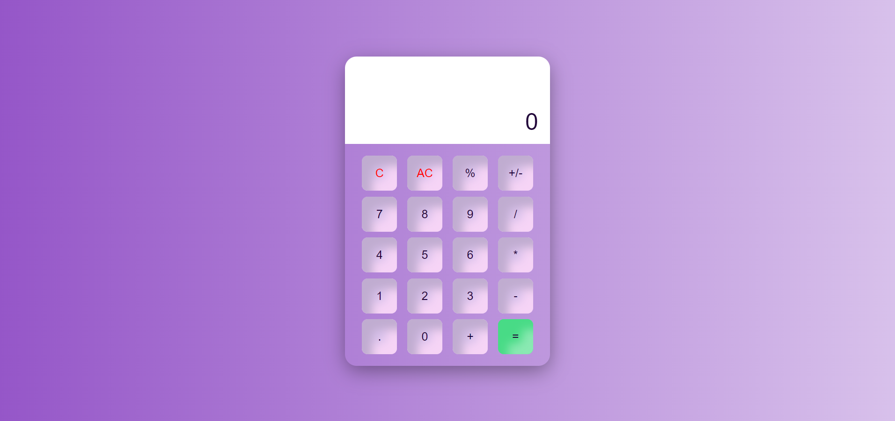

# <h1 align="center">React - Calculator App 📱</h1> 

<p align="center">A simple Calculator App built using ReactJS.</p>



## 💻 Live Demo

Check the live demo here 👉 [Demo](https://calculator-app-kaderbrl.vercel.app/) 

## 📋 Instructions

First clone this repository.

```shell
git clone https://github.com/kaderbrl/calculator-app-react.git
```

Install dependencies. Make sure you already have [`node.js`](https://nodejs.org/en/) & [`npm`](https://www.npmjs.com/) installed in your system.

```shell
$ npm install # or yarn
```

Run it.

```shell
$ npm start # or yarn start
```

## Languages and Tools

<div align="left">
  
  
  
  
  
</div>
